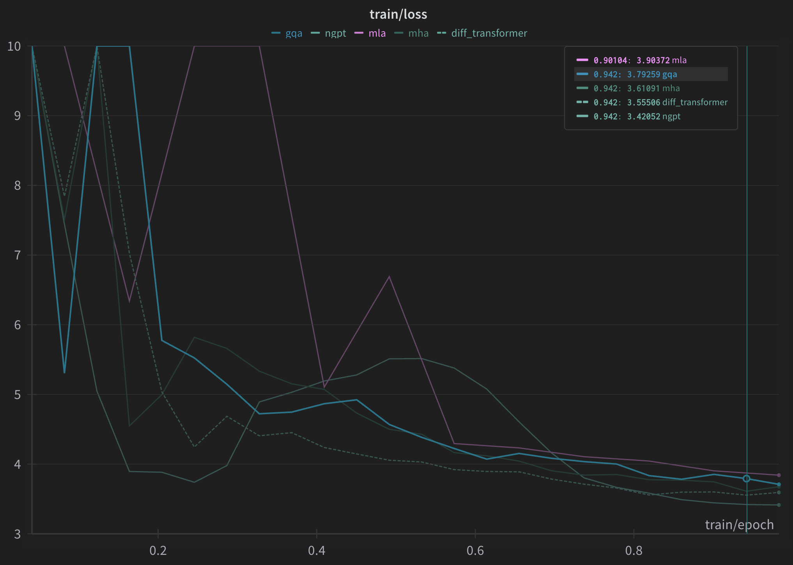

# NanoFormer

NanoFormer is a lightweight transformer model implementation designed for efficient training and inference. It is a collection of transformer architectures (and a few variants) that can be easily experimented with.

### Blog:
[Here's the blog](https://datta0.github.io/posts/transformer-showdown/) comparing different architectures, their memory and KVCache requirements. Do give a read.
Here's a sneak peak



## Features

- Supports transformers variants like:
    * Multi Head Attention (MHA)
    * Grouped Query Attention (GQA)
    * [Differential Transformer](https://arxiv.org/abs/2410.05258)
    * [normalised GPT (nGPT)](https://arxiv.org/abs/2410.01131)
- Dynamic batch size handling with efficient padding
- Mixed precision training (bfloat16)
- Gradient checkpointing for memory efficiency
- Gradient accumulation support
- Wandb integration for experiment tracking
- Automatic model checkpointing
- Custom training loop with validation
- Torch compile support 

## Installation

``` bash
git clone https://github.com/yourusername/nanoformer.git
cd nanoformer
```

## Usage

### Training

To train the model with default parameters:

``` bash
python train.py \
    --dataset "imdatta0/wikipedia_en_sample" \
    --batch_size 8 \
    --gradient_accumulation_steps 16 \
    --num_epochs 1 \
    --lr 5e-4 \
    --hidden_dim 256 \
    --num_hidden_layers 8 \
    --attention_type="gqa" \ # or [one of "diff", "ngpt"]
    --compile
    # --logit_cap = None 
    # --logit_scale = 1.0
```

To estimate the number of tokens in a dataset and the model's param count with given config:
(will need to refactor this to not create the model for estimation)

```bash
python train.py \
    --dataset "imdatta0/wikipedia_en_sample" \
    --batch_size 8 \
    --gradient_accumulation_steps 16 \
    --num_epochs 1 \
    --lr 5e-4 \
    --hidden_dim 256 \
    --num_hidden_layers 8 \
    --estimate
```

**Note:** If you use --compiple, it might take a while to get the initial batch started. So the tqdm ETA estimates might be off. The GPU utilisation will pick up after a few batches and training speeds up. So please be patient.

## Checkpoint Loading

NanoFormer supports resuming training or running inference from checkpoints saved during training. Both `.bin` and `.safetensors` formats are supported (if you have the `safetensors` package installed).

To resume from a checkpoint, use the `--resume_from_checkpoint` flag and optionally specify `--checkpoint_path` to the directory containing your checkpoint (either a run directory or a specific checkpoint subdirectory):

```bash
python train.py \
    --dataset "imdatta0/wikipedia_en_sample" \
    --resume_from_checkpoint \
    --checkpoint_path "/home/datta0/models/nanoformer/your_run_name/checkpoint-2048"
```

If `--checkpoint_path` is not provided, it will attempt to load from the latest checkpoint in the run directory specified by `--run_name`.

## Head Similarity Loss (HeadSim)

NanoFormer supports a head similarity loss to encourage diversity between attention heads. This is useful for research and ablation studies.

### HeadSim Loss Flags

- `--head_sim_loss` : Enable head similarity loss calculation and logging.
- `--head_sim_loss_weight` : Set the weight for the head similarity loss (default: 1.0). If set to 0, the loss is still logged but not included in the gradients or main loss.
- `--head_sim_loss_after_warmup` : Only apply head similarity loss after the warmup phase (as determined by `--warmup_ratio`). Before warmup, the loss is logged but not included in the gradients.

**Notes:**
- The head similarity loss is always computed and logged for monitoring, but only included in the backward pass if the weight is nonzero and (if enabled) after warmup.
- The computation is fully vectorized for speed.

### Example: Enable HeadSim Loss Only After Warmup

```bash
python train.py \
    --dataset "imdatta0/wikipedia_en_sample" \
    --batch_size 8 \
    --gradient_accumulation_steps 16 \
    --num_epochs 1 \
    --lr 5e-4 \
    --hidden_size 256 \
    --num_hidden_layers 8 \
    --attention_type="gqa" \
    --head_sim_loss \
    --head_sim_loss_weight 1.0 \
    --head_sim_loss_after_warmup
```

### Example: Log HeadSim Loss But Do Not Affect Gradients

```bash
python train.py \
    --dataset "imdatta0/wikipedia_en_sample" \
    --head_sim_loss \
    --head_sim_loss_weight 0
```

## TODO
- [x] Implement [Differential Transformer](https://datta0.substack.com/i/150138108/differential-transformer)
- [x] Implement [nGPT](https://arxiv.org/abs/2410.01131)
- [ ] Implement custom optimisers like [Shampoo](https://github.com/jettify/pytorch-optimizer/blob/master/torch_optimizer/shampoo.py), [SOAP](https://arxiv.org/abs/2409.11321) and whatnot
- [ ] Add support for Sliding Window Attention
- [x] Modify configs to be closer to Chinchilla Optimal Ratios

# WIP
- [ ] Inference support
- [x] Loading from checkpoint (supports .bin and .safetensors)